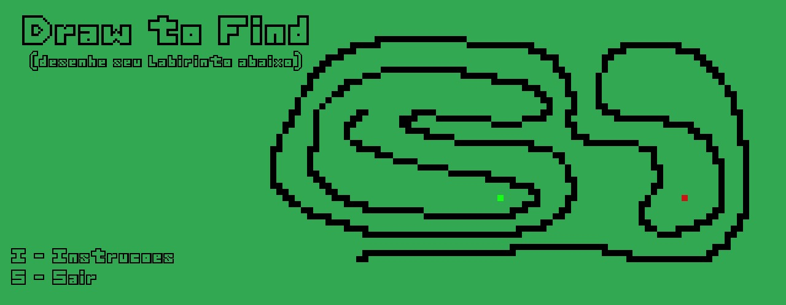
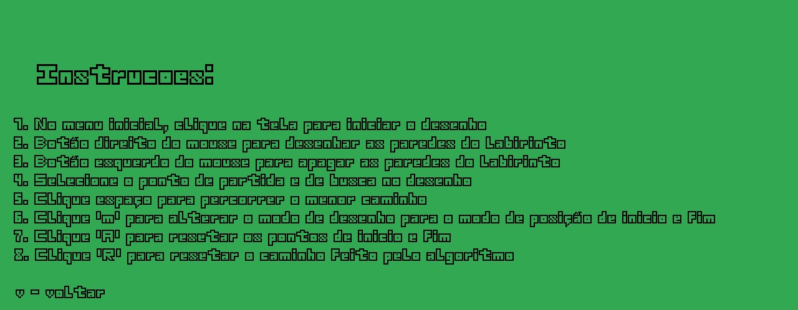
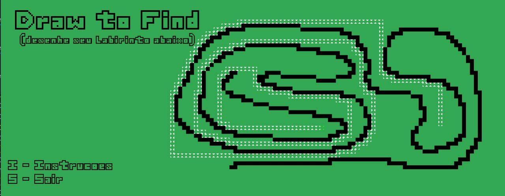

# Draw to Find

**Número da Lista**: X 
**Conteúdo da Disciplina**: Grafos 2 

## Alunos
|Matrícula | Aluno |
| -- | -- |
| 18/0121995  |  Herick de Carvalho Lima |
| 19/0054832  |  Arthur Talles de Sousa Cunha |

## Sobre 
Descreva os objetivos do seu projeto e como ele funciona. 
No "Draw to Find", o usuário realiza um desenho de um labirinto, no qual suas linhas são interpretadas como paredes pelo código, e define pontos de partida e de destino por meio dos quais o algoritmo de Dijkstra vai atuar e gerar o menor caminho entre eles. 
## Screenshots

## Instalação 
**Linguagem**: Python 
## Uso 
Para utilizá-lo é necessário:

1. Clonar o repositório

    SSL:
    $ git clone git@github.com:projeto-de-algoritmos/Grafos2_DrawToFind.git
    
    HTTPS:
    $ git clone https://github.com/projeto-de-algoritmos/Grafos2_DrawToFind.git

2. Instalar o Python

    $ sudo apt-get install python3

3. Instalar a biblioteca pygame
   
    pip install pygame

3. Executar em sua máquina
   
    python3 main.py

